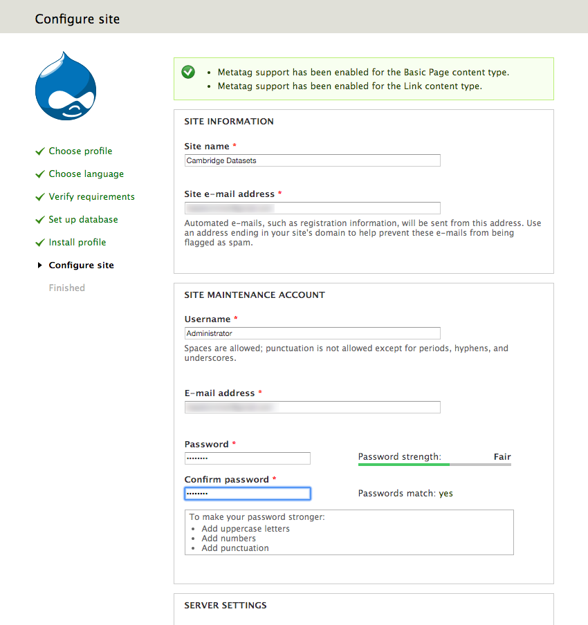

# Cambridge Datasets Application

The <b>Cambridge Datasets Application</b> allows external users to submit a formal request to access one or more Cambridge University datasets. The Datasets Application forwards the request to internal reviewers who then submit their comments via the application. A final reviewer approves or rejects the user’s request within the application, based on the comments of previous reviewers. 

The <b>Cambridge Datasets Application</b> uses Drupal as an application framework and comes as a <i>Drupal Profile</i>, extending the `Cambridge 2.0 Full Profile` available from: 

https://github.com/misd-service-development/drupal-cambridge-profile/releases

The <b>Cambridge Datasets Drupal Profile</b> contains everything required for a University of Cambridge Drupal site (such as the University's house style and Raven authentication), and includes a variety of modules commonly used (such as Workbench, Media and CKEditor). 

## Installing Cambridge Datasets Application

### 1. Create MySQL Database
Logon to MySQL as root user and create new database for Drupal:

```
CREATE DATABASE drupal_datasets
```

Create Drupal user:

```
CREATE USER 'drupaluser'@'localhost' IDENTIFIED BY '[enter_drupal_password]';
```

Give new user access to Drupal database:
```
GRANT ALL PRIVILEGES ON drupal_datasets.* TO 'drupaluser'@'localhost';
FLUSH PRIVILEGES
```

### 2a. Download Application - Fastest
- Install 'Drush 7' Drupal command line tool by following instructions at:
https://docs.drush.org/en/7.x/install/

- Navigate to the parent web folder you wish to serve the application from and type:
```
drush dl drupal-7
sudo mv drupal-7* drupal
cd drupal/profiles/
git clone https://github.com/SH801/cambridge_datasets_application.git
cd ../../
sudo chown -R _www:_www drupal
```
Note: you should replace `_www` with the user/group your webserver is running under.

- Configure your webserver to point to the `drupal` folder created above.

### 2b. Download Application - Step-by-step

- Download Drupal 7 from:
https://www.drupal.org/project/drupal

- Unpack the Drupal archive and move to the appropriate location on your webserver

- Download the Cambridge Datasets Drupal profile from: 
https://github.com/SH801/cambridge_datasets_application/archive/master.zip

- Unzip the archive, rename to `cambridge_datasets_application` and move to the `drupal/profiles/` folder

- Navigate to the top directory containing the Drupal folder and type:
```
sudo chown -R _www:_www drupal
```

Note: you should replace `_www` with the user/group your webserver is running under.

### 3. Install Cambridge Datasets Application
Using a web browser, navigate to the Drupal folder served by your webserver. You should see the following screen:


Click <b>Save and continue</b>. After a while you should see the following screen:


Enter the fields exactly as they appear above; enter the password used to create the `drupaluser` above in the <b>Database password</b> field (see <b>Create MySQL Database</b> section, above). 

Click <b>Save and continue</b>. After a while you should see the following screen:



It is recommended you copy the field inputs as they appear above, changing the `Site e-mail address` and `Email address` fields to reflect the email address of the site administrator. Click <b>Save and continue</b> to finish the setup process.

Once the install has completed, click <b>Go to site</b> and you should see:


### 4. Additional configuration
Before you can start using the application, you will need to configure your SMTP settings and enter the path of a folder that will store backups of submitted requests (the <b>Datastore Path</b>).

#### SMTP Settings 
To enter your SMTP settings, click <b>Admin -> SMTP Settings</b>. Once you have entered your SMTP settings, check they work by clicking <b>Admin -> Send test email</b>.

#### Datastore Folder
A backup of all requests submitted will be saved into a backup folder. To set up this folder, do the following:
- Login to your webserver and create the backup folder, eg `/home/user/cambridgedatasets/saveddata`
- Give webserver permission to write to backup folder by going to parent directory and changing owner:
```
cd /home/user/cambridgedatasets
sudo chown -R _www:_www saveddata
```
- Go to Drupal, click on the <b>Cambridge Datasets Module Settings</b> button on the top menu bar and enter the path into the <b>Datastore Path</b> field, eg. `/home/user/cambridgedatasets`

#### Setting up cron job
A cron job must be set up to ensure mail is delivered to reviewers and applicants on a periodic basis. To set up the cron job, do the following:
- Copy the file from `cambridge_datasets_application/cron/processmailqueue.sh` to a separate folder outside the Drupal folder, eg `/home/user/cambridgedatasets/`
- Edit `processmailqueue.sh` to reflect the website address of your application. For example change:
```
http://datasets.yourdepartment.cam.ac.uk/cambridge_datasets/processmessagequeue
```

TO

```
http://datasets.psychiatry.cam.ac.uk/cambridge_datasets/processmessagequeue
```

- Give `processmailqueue.sh` the necessary permissions to execute by typing:
```
sudo chmod +x processmailqueue.sh
```
- Set up a cronjob to run `processmailqueue.sh` by typing:
```
crontab -e
```
- Enter a crontab formatted string, for example:

```
# Every minute:
* * * * * /home/user/cambridgedatasets/processmailqueue.sh
```

OR:

```
# Every hour:
0 * * * * /home/user/cambridgedatasets/processmailqueue.sh
```
Save the crontab. 

- Type `mail` to check that every call to `processmailqueue.sh` generates no errors.

- To check the cron job is working correctly with the Datasets system, go to <b>Admin -> Add test email to queue</b>. You should be sent a test email the next time the cron job is run.

- Once you are satisfied the cron job is running as it should, type 
```
crontab -e
``` 

- Add the following to the top of the cron job and save the job to prevent the cron job sending an internal mail every time it's run:

```
MAILTO=""
```
